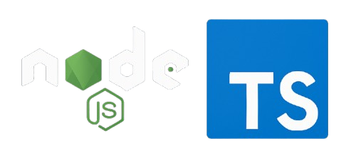

# 🎵 Darkify Server

A Spotify OAuth 2.0 authentication backend built using **Node.js**, **TypeScript**, and **Express**.

<p align="center">
  
</p>

## 🚀 Features

- Spotify OAuth login flow  
- Access and refresh token retrieval  
- Lightweight Express backend  
- Modern tooling with Pino logging and dotenv support  

## 🧾 Project Structure

```
dist/                  # Compiled JavaScript output
src/
├── services/
│   ├── login.services.ts
│   └── callback.services.ts
├── types/
│   └── token.ts
├── utils/
│   ├── logger.ts
│   └── getBaseUrl.ts
├── handlers/
│   ├── error.handler.ts
│   └── route.handler.ts
├── server.ts
├── main.ts
└── index.ts
```

> When you run `yarn build`, TypeScript transpiles everything into the `dist/` folder. You can then run `node dist/index.js` in production.

## 🔧 Setup Instructions

### 1. Clone the repository

```bash
git clone https://github.com/Dark-in-Star/Darkify-Server.git
cd Darkify-Server
```

### 2. Install dependencies

```bash
yarn install
```

### 4. Run in development

```bash
yarn dev
```

### 5. Build for production

```bash
yarn build
```

This generates the compiled output in the `dist/` folder:

```
dist/
├── index.js
├── main.js
├── server.js
└── ...other compiled files
```

### 6. Run in production

```bash
node dist/index.js
```

## ☁️ Deployment

You have several options for deploying your Darkify Server:

1. **Heroku**  
   - Create a new app: `heroku create your-app-name`  
   - Push your code: `git push heroku main`  
   - Set environment variables:  
     ```bash
     heroku config:set CLIENT_ID=… CLIENT_SECRET=… PORT=5000
     ```
2. **Vercel** (Serverless Functions)  
   - Install Vercel CLI: `npm i -g vercel`  
   - Run: `vercel --prod`  
   - Configure env vars in the Vercel dashboard.
3. **Docker**  
   - Create a `Dockerfile`:
     ```dockerfile
     FROM node:18-alpine
     WORKDIR /app
     COPY package.json yarn.lock ./
     RUN yarn install --production
     COPY . .
     RUN yarn build
     CMD ["node", "dist/index.js"]
     ```
   - Build & run:
     ```bash
     docker build -t darkify-server .
     docker run -d -p 5000:5000        -e CLIENT_ID=… -e CLIENT_SECRET=…        darkify-server
     ```
4. **AWS Elastic Beanstalk / ECS**  
   - Package your app, configure a Node.js environment, and deploy via the AWS console or CLI.
5. **Render**  
   - Sign in to [Render](https://render.com) and create a new **Web Service**.  
   - Connect your GitHub/GitLab repo and select the `Darkify-Server` project.  
   - Set the **Build Command** to:
     ```
     yarn build
     ```
   - Set the **Start Command** to:
     ```
     node dist/index.js
     ```
   - Add environment variables (`CLIENT_ID`, `CLIENT_SECRET`, `PORT`) in the Render dashboard under **Environment**.  
   - Choose your instance plan and click **Create Web Service** to deploy automatically on each push.
---

Created with ❤️ by [Sounak Guha](https://github.com/Dark-in-Star)